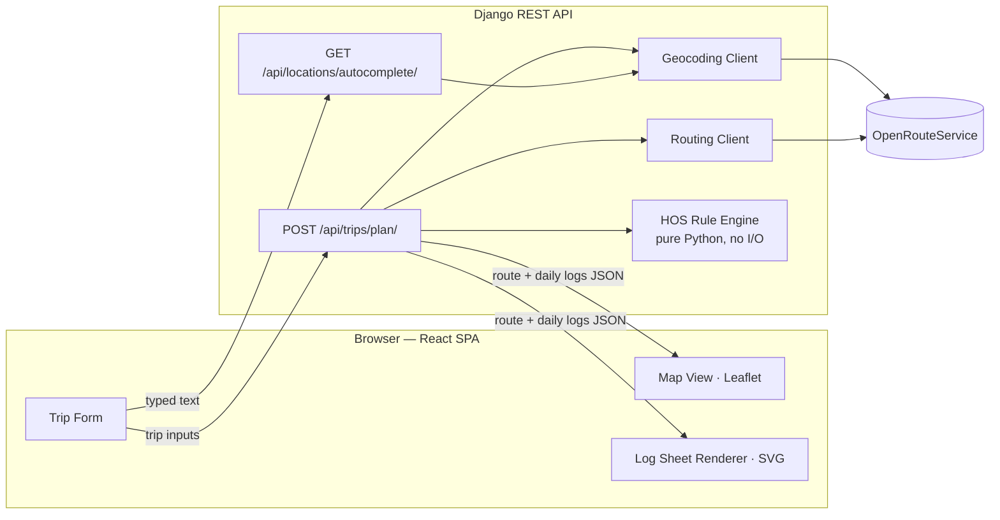
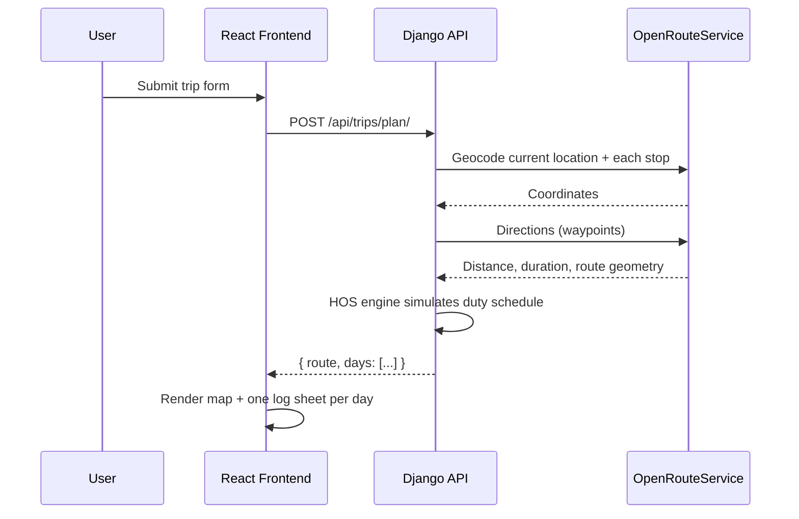

# Architecture

A technical reference for this codebase: system design, high-level design,
low-level design, and a code-level walkthrough of what actually runs when a
user does something. If you're new to the repo, read top to bottom; if
you're debugging something specific, jump to "User Flow" and find the step
that matches what broke.

## In plain terms

The app has two workers:

- **The face (React frontend)** — a form where the driver enters where they
  currently are, an ordered list of stops (each a pickup or a dropoff), and
  how many hours they've already worked this week. It later shows a map and
  the filled-out paper logs.
- **The brain (Django backend)** — takes those inputs, asks a map service for
  the actual route and its distance/duration, then runs a rules simulator
  that thinks like a compliance officer: "drive for a while, then legally must
  take a break, then drive more, then must stop for the night, then start a
  new day" — until the whole trip is scheduled out hour by hour. It hands back
  the route plus a day-by-day breakdown of what the driver was doing.

The frontend does no legal-rules thinking of its own — it only draws whatever
the backend already computed: the route on a map, and duty-status blocks onto
the log sheet grid, one sheet per day.

---

## System Design

### Tech stack

| Layer | Choice | Notes |
|---|---|---|
| Frontend framework | React 19 + Vite | SPA, no router (single screen) |
| Frontend map | Leaflet + react-leaflet | Renders over free OpenStreetMap tiles |
| Backend framework | Django 6 + Django REST Framework | One app (`trips`), no auth, no DB writes in the core flow |
| Database | SQLite (Django default) | Present only for Django's own boilerplate (admin/session tables); the product has no models of its own — see "Stateless backend" below |
| External API | OpenRouteService (ORS) | Single third-party dependency, used for geocoding, autocomplete, and routing |
| Frontend hosting | Vercel (static build) | |
| Backend hosting | Render (Gunicorn) | |

### External dependency

Everything location-aware routes through **OpenRouteService**:

| Backend module | ORS endpoint | Purpose |
|---|---|---|
| `services/geocoding.py` → `geocode()` | `/geocode/search` | location text → `(lat, lng)` |
| `services/geocoding.py` → `autocomplete()` | `/geocode/autocomplete` | partial text → place suggestions |
| `services/routing.py` → `get_route()` | `/v2/directions/driving-hgv/geojson` | ordered waypoints → distance, duration, geometry, per-leg breakdown |

One provider for all three keeps API-key/quota management simple, at the
cost of a single point of failure (see "Key design decisions").

### Component diagram



---

## High-Level Design

Client-server, stateless REST API. Two endpoints drive the whole app; one
does all the real work.

### Request flow (plan a trip)



### Frontend component tree

```
App
├─ AppHeader (logo, title, theme toggle)
├─ HowItWorks              (only before the first successful plan)
├─ TripForm
│   └─ LocationAutocomplete (× 1 for current location, × 1 per stop)
├─ ResultsSkeleton          (only while isSubmitting)
└─ (once result exists, isSubmitting is false)
   ├─ alert banners (compliance disclaimer, 34-hour-restart warning)
   ├─ StatTiles
   ├─ MapView
   ├─ print button
   └─ LogSheetList
       └─ LogSheet (× 1 per day)
```

---

## User Flow (codewise)

A step-by-step trace of what actually executes for each thing a user does,
file-by-file. This is the section to read if you're onboarding or debugging.

### 1. Cold load

- `main.jsx` mounts `<App/>` inside `<StrictMode>`.
- `App.jsx` calls `useTheme()` (`hooks/useTheme.js`): reads `localStorage['meridian-theme']`, falling back to `prefers-color-scheme`; sets `document.documentElement.dataset.theme`, which `index.css`'s `:root[data-theme='light'|'dark']` blocks pick up.
- Initial `App` state: `result=null`, `tripInputs=null`, `error=null`, `isSubmitting=false`, `hasPlannedOnce=false`.
- Since `hasPlannedOnce` is false, `App` renders the `.layout-intro` branch: `<HowItWorks/>` beside a card containing `<TripForm/>`.
- `TripForm.jsx` initializes its own local state — `values` (`INITIAL_VALUES`: empty current location / cycle hours / start time) and `stops` (`INITIAL_STOPS`: two empty rows, pickup + dropoff).

### 2. Typing a location (autocomplete)

- Typing into any `LocationAutocomplete` instance (current location, or any stop's location field) fires its `onChange`, which bubbles up to `TripForm`'s `setField` (current location) or `setStopField(index, 'location', value)` (a stop) — updating `TripForm`'s local state, re-rendering the controlled input.
- Inside `LocationAutocomplete`, a `useEffect` keyed on `value` fires: under 3 characters it clears suggestions; otherwise it debounces 300ms, then calls `getLocationSuggestions(value, signal)` (`api/locationService.js`) → `GET /api/locations/autocomplete/?q=...`.
- Backend: `LocationAutocompleteView.get()` (`views.py`) strips/length-checks the query, then calls `autocomplete()` (`services/geocoding.py`), which hits ORS and maps results to `{label, lat, lng}`. Throttled at 60/min per IP (`throttle_scope='location_autocomplete'`).
- Selecting a suggestion calls `handleSelect`, which sets a `skipNextLookupRef` flag (so setting the field to the chosen label doesn't immediately re-trigger a lookup) and closes the dropdown.

### 3. Submitting a plan ("Plan trip")

- `TripForm`'s form `onSubmit` calls `buildPayload(values, stops)`, shaping `{ current_location, stops: [{location, type, extra_delay_hours}], current_cycle_used_hours: Number(...), trip_start_time: value || null }`, then calls the `onSubmit` prop — `App.jsx`'s `handleSubmit`.
- `App.handleSubmit`: sets `isSubmitting=true`, clears `error`/`result`, calls `planTrip(payload)` (`api/tripService.js`) → `POST /api/trips/plan/`.
- Backend `PlanTripView.post()` (`views.py`, throttled 20/min per IP): validates via `TripRequestSerializer` (`serializers.py`) — `current_location`, `stops` (≥2 entries, each `location` + `type` + optional `extra_delay_hours`), `current_cycle_used_hours` (0–70), optional `trip_start_time`.
- `plan_trip()` (`planner.py`) then:
  1. `geocode()`s the current location and every stop → `(lat, lng)`.
  2. `get_route()`s all waypoints in order via ORS directions → overall distance/duration/geometry + one leg per consecutive pair.
  3. Converts `trip_start_time` to a float hour; builds one `RouteLeg` and one on-duty-hours value (`1 + extra_delay_hours`) per stop.
  4. Calls `build_duty_schedule()` (`hos/engine.py`) — see "HOS engine internals" below — producing a flat, time-ordered list of `LogEntry`.
  5. `split_into_days()` slices that timeline at 24-hour boundaries into `DaySchedule`s (one per calendar day).
  6. Builds the map's `stops` array: current + each real stop (in request order) + any rest/fuel stops, positioned along the route geometry via `point_at_distance()` (`services/geometry.py`).
  7. Returns the shape documented in "API contract" below.
- On success, `App` sets `result`, `tripInputs` (the payload just sent, reused later for the print header), and `hasPlannedOnce=true`; `isSubmitting` flips false in `finally`. `TripForm`'s own state is untouched by this transition (see the remount-bug note below) — every typed field is still there.
- Rendering: disclaimer banner → optional 34-hour-restart warning → `StatTiles` → `MapView` (polyline + stop markers + "Open in Google Maps" link from `utils/googleMapsLink.js`) → print button → `LogSheetList` (one `LogSheet` SVG per day).

### 4. Loading state

- While `isSubmitting` is true, `App` renders `<ResultsSkeleton/>` — shimmering placeholders shaped like the stat tiles/map/log sheet — instead of stale or blank results.

### 5. Editing and replanning ("Replan trip")

- Once a result exists, `TripForm`'s submit button relabels to "Replan trip" and the card title to "Trip details" (both driven by the `hasResult` prop).
- The user can add a per-stop delay, tweak any field, or add/remove stops (`addStop`/`removeStop`), then resubmit — re-entering the exact same path as step 3. There's no partial-update endpoint; every replan re-runs the full simulation from scratch (see "Plans are recomputed, not patched" below), which is why a delay can correctly cascade into a new mandatory rest later in the trip.

### 6. Error path

- `geocode()` raising `GeocodingError` → `PlanTripView` returns `400 {"detail": "..."}`. `get_route()` raising `RoutingError` → `502`.
- `tripService.planTrip()` throws using that `detail` (or a flattened DRF validation-error summary) whenever `response.ok` is false.
- `App`'s catch sets `error`, rendered as a red alert; `result` stays `null`. The form is never unmounted on this path, so typed values survive.
- Exceeding a throttle returns `429`; surfaced through the same catch path.

### 7. Printing

- "Print / Save as PDF" calls `window.print()`. `App.css`'s `@media print` block hides every `.no-print` element (header, form, stat tiles, map, buttons, footer) and reveals `.print-only` elements (the trip-context line in `LogSheetList`) — one log sheet per landscape page.

### 8. Theme toggle

- The header's sun/moon button calls `toggleTheme()` (`useTheme.js`), flipping `theme`, persisting it to `localStorage`, and setting `document.documentElement.dataset.theme` — picked up immediately by CSS, independent of OS preference.

---

## Low-Level Design

### Backend directory map (`backend/`)

```
config/                  Django project: settings.py, urls.py, wsgi.py
trips/
├─ views.py              PlanTripView, LocationAutocompleteView, health_check
├─ serializers.py        TripRequestSerializer, TripStopSerializer
├─ planner.py            plan_trip() — orchestrates geocode → route → engine → response shape
├─ urls.py                three routes: health/, trips/plan/, locations/autocomplete/
├─ hos/
│  └─ engine.py          HOSEngine, build_duty_schedule(), split_into_days() — pure Python, no I/O
├─ services/
│  ├─ geocoding.py        geocode(), autocomplete() — ORS geocode endpoints
│  ├─ routing.py          get_route() — ORS directions endpoint
│  ├─ geometry.py         haversine_miles(), point_at_distance() — polyline interpolation
│  └─ exceptions.py       GeocodingError, RoutingError
├─ models.py, admin.py, apps.py, migrations/   Django boilerplate — unused; the app has no persisted models
└─ tests/                 one file per module above, plus test_views.py (integration-level)
```

### HOS engine internals (`hos/engine.py`)

Pure, deterministic, no I/O — walks through the trip's required activities in
order (optional off-duty block from midnight to the trip's start time → drive
to the first stop → on-duty time there → drive to the next stop → ... for
every stop in the request, with fuel stops spliced in every 1,000 miles).

| Type | Kind | Purpose |
|---|---|---|
| `DutyStatus` | `str, Enum` | `off_duty`, `sleeper_berth`, `driving`, `on_duty_not_driving` |
| `LogEntry` | dataclass | one timeline entry: `status, start_hour, end_hour, label, distance_marker_miles` |
| `RouteLeg` | dataclass | one drive segment: `distance_miles, duration_hours, label` |
| `HOSEngine` | class | the simulator (state + methods below) |
| `DayEntry` / `DaySchedule` | dataclass | one day's slice of the timeline + per-status totals |

`HOSEngine` tracks, as it walks:

- hours driven in the current duty day (11-hour limit)
- time remaining in the current 14-hour on-duty window
- time since the last 30-minute break (required after 8 cumulative driving hours)
- cycle hours used so far (70-hour/8-day limit, seeded from `current_cycle_used_hours`)
- miles since the last fuel stop (1,000-mile interval)

Public methods: `drive(distance_miles, duration_hours, label)`, `on_duty(duration_hours, label)`.
Private helpers insert the mandatory rest when a limit is hit: `_take_break()` (30 min), `_take_daily_reset()` (10hr off-duty), `_take_restart()` (34hr), `_take_fuel_stop()` (30 min) — priority order is break → daily reset → restart → fuel, since regulatory rests outrank the operational fuel-stop assumption.

Module-level entry points: `build_duty_schedule(current_cycle_used_hours, legs, stop_labels, trip_start_hour=0.0, on_duty_hours=None)` runs the whole simulation and returns a flat `list[LogEntry]`; `split_into_days(entries)` splits that into `list[DaySchedule]`.

Each stop's on-duty time defaults to 1 hour but can be overridden per stop via `on_duty_hours` — this is how a reported delay at a stop ("I got held up 2 hours at pickup") flows through: the rest of the simulation runs from that extended point, so a delay that pushes the driver past a duty-window limit correctly inserts a new mandatory rest, rather than the plan just being wrong past that stop.

### API contract

```
POST /api/trips/plan/

Request:
{
  "current_location": "Denver, CO",
  "stops": [
    { "location": "Colorado Springs, CO", "type": "pickup", "extra_delay_hours": 2 },
    { "location": "Albuquerque, NM", "type": "dropoff" }
  ],
  "current_cycle_used_hours": 12,
  "trip_start_time": "06:30"
}

Response:
{
  "route": {
    "distance_miles": 420.5,
    "duration_hours": 7.2,
    "geometry": [[lat, lng], ...],
    "stops": [
      { "type": "pickup", "label": "Colorado Springs, CO", "lat": ..., "lng": ... },
      { "type": "fuel", "label": "Fuel stop (mile 1000)", "lat": ..., "lng": ... },
      { "type": "dropoff", "label": "Albuquerque, NM", "lat": ..., "lng": ... }
    ]
  },
  "days": [
    {
      "day_number": 1,
      "entries": [
        { "status": "on_duty", "start_hour": 6.0, "end_hour": 7.0, "label": "Pickup" },
        { "status": "driving", "start_hour": 7.0, "end_hour": 11.5, "label": "En route" },
        ...
      ],
      "totals": { "driving": 8.5, "on_duty": 2.0, "off_duty": 10.0, "sleeper_berth": 0 }
    }
  ],
  "summary": {
    "total_trip_hours": 13.3,
    "requires_34_hour_restart": false
  }
}
```

```
GET /api/locations/autocomplete/?q=Denv

Response:
{
  "results": [
    { "label": "Denver, CO, USA", "lat": 39.74, "lng": -104.99 },
    ...
  ]
}
```

Queries under 3 characters skip the ORS call and return `results: []`
immediately; ORS failures soft-fail to `results: []` with a 200 rather than
surfacing an error, since suggestions are a typing affordance, not the core
planning flow.

Both endpoints return `429 Too Many Requests` once their per-IP throttle
rate is exceeded (`trip_plan`: 20/min, `location_autocomplete`: 60/min,
overridable via `TRIP_PLAN_THROTTLE_RATE` / `AUTOCOMPLETE_THROTTLE_RATE`).

### Frontend directory map (`frontend/src/`)

```
main.jsx                       Mounts <App/> inside <StrictMode>
App.jsx                        Top-level state machine (see User Flow above)
App.css, index.css             All styles; index.css also holds the theme CSS variables
api/
├─ tripService.js               Fetch wrapper for POST /api/trips/plan/
└─ locationService.js           Fetch wrapper for GET /api/locations/autocomplete/
hooks/
└─ useTheme.js                  Light/dark theme state, persisted to localStorage
components/
├─ AppHeader.jsx                 Logo, title/subtitle, theme-toggle button
├─ HowItWorks.jsx                 3-step explainer, shown only before the first plan
├─ TripForm.jsx                   All trip inputs + submit/replan/try-example
├─ LocationAutocomplete.jsx       Debounced place-suggestion dropdown (reused per location field)
├─ ResultsSkeleton.jsx            Shimmering placeholder shown while isSubmitting
├─ StatTiles.jsx                  Distance / driving time / total time / day-count, each with an icon
├─ MapView.jsx                    Leaflet map — polyline + stop markers + Google Maps link
├─ LogSheet.jsx                   SVG renderer for one day's FMCSA grid
└─ LogSheetList.jsx               One LogSheet per day + the print-only trip-context line
utils/
└─ googleMapsLink.js             Builds a Google Maps directions URL from the trip's real stops
```

### State shape reference

`App.jsx` (top-level):

| State | Shape | Set by |
|---|---|---|
| `result` | API response body, or `null` | `handleSubmit` success |
| `tripInputs` | the payload last submitted, or `null` | `handleSubmit` success — reused for the print header |
| `error` | string message, or `null` | `handleSubmit` catch |
| `isSubmitting` | bool | `handleSubmit` start/finally |
| `hasPlannedOnce` | bool, never resets to false | first `handleSubmit` success |

`TripForm.jsx` (local, independent of `App`):

| State | Shape |
|---|---|
| `values` | `{ current_location, current_cycle_used_hours, trip_start_time }` — all strings, converted to numbers/null in `buildPayload` |
| `stops` | `[{ location, type: 'pickup'\|'dropoff', extra_delay_hours }, ...]` — min length 2 |

`LocationAutocomplete.jsx` (local, one instance per location field):

| State | Purpose |
|---|---|
| `suggestions` | last-fetched results array |
| `isOpen` | whether the dropdown is showing |
| `isSearching` | drives the in-field spinner |
| `activeIndex` | keyboard-selected suggestion index |

### A regression worth knowing about

`App.jsx`'s how-it-works/form toggle keeps `TripForm` at one stable tree
position (only the *content around* it — `HowItWorks`, the card title —
changes) rather than branching into two differently-shaped subtrees. An
earlier ternary that swapped whole subtrees caused React to unmount and
remount `TripForm` — silently wiping every field — the instant the first
plan succeeded. If a future refactor reintroduces a ternary that swaps
`TripForm`'s surrounding structure, watch for this regression.

---

## Key design decisions

- **Stateless backend.** No DB writes in the core flow — a trip plan doesn't
  need to persist between requests, so there's no `Trip` model, no
  migrations beyond Django's defaults, and no extra moving parts to deploy
  or go stale.
- **HOS engine is pure Python.** No network calls, no Django imports beyond
  plain data classes. This makes it trivial to unit-test with fake
  distances/durations instead of hitting a real routing API in tests.
- **Single external dependency (OpenRouteService)** for geocoding,
  autocomplete, and routing, to keep API-key/quota management to one
  provider — at the cost of a single point of failure with no caching or
  fallback provider today.
- **Domain assumptions**: property-carrying driver, 70hrs/8-day cycle, no
  adverse driving conditions, fuel stop every 1,000 miles, 1 hour at each
  stop.
- **Stops are a generic ordered list**, not a hardcoded pickup + dropoff pair.
  The engine treats every stop identically (drive the leg, then on-duty time);
  only the `type` tag (`pickup`/`dropoff`) differs, and it's used purely for
  map-marker styling, not schedule math.
- **Plans are recomputed, not patched.** There's no partial-update endpoint —
  an edit (e.g. a per-stop delay) just re-runs the same stateless
  `POST /api/trips/plan/` with adjusted inputs, and the whole schedule is
  simulated fresh. That's why a delay at one stop can correctly cascade into
  a new mandatory rest later in the trip instead of silently going stale.
- **Per-IP rate limiting on both external-facing endpoints.** Every
  `/api/trips/plan/` and `/api/locations/autocomplete/` request costs a paid
  OpenRouteService call — DRF's `ScopedRateThrottle` caps worst-case cost
  from a bug, bot, or single heavy user (defaults: 20/min, 60/min). Uses
  Django's default local-memory cache, so counts reset per-process and
  aren't shared across gunicorn workers if that changes — fine for a
  single-process deployment, worth revisiting if that scales out.

## Deployment topology

- **Frontend** — static Vite build deployed to Vercel
- **Backend** — Django (Gunicorn) deployed to Render, env-configured secret
  key, allowed hosts, CORS origins, and the OpenRouteService API key
