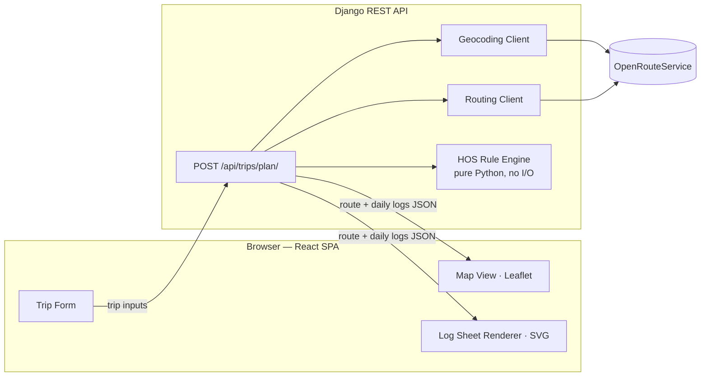
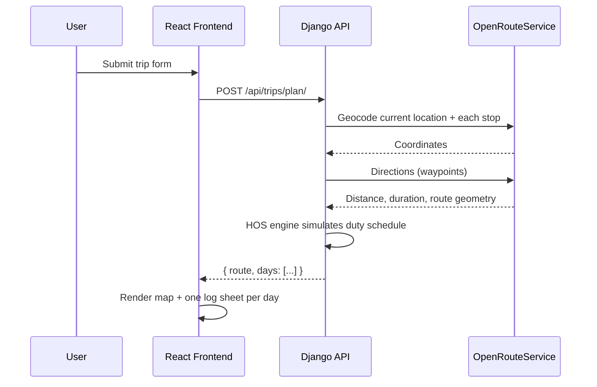

# Architecture

## In plain terms

The app has two workers:

- **The face (React frontend)** — a form where the driver enters where they
  currently are, an ordered list of stops (each a pickup or a dropoff), and
  how many hours they've already worked this week. It later shows a map and
  the filled-out paper logs.
- **The brain (Django backend)** — takes those inputs, asks a map service for
  the actual route and its distance/duration, then runs a rules simulator
  that thinks like a compliance officer: "drive for a while, then legally must
  take a break, then drive more, then must stop for the night, then start a
  new day" — until the whole trip is scheduled out hour by hour. It hands back
  the route plus a day-by-day breakdown of what the driver was doing.

The frontend does no legal-rules thinking of its own — it only draws whatever
the backend already computed: the route on a map, and duty-status blocks onto
the log sheet grid, one sheet per day.

## High-Level Design

Client-server, stateless REST API. One core endpoint drives the whole flow.



### Request flow



### Key design decisions

- **Stateless backend.** No DB writes in the core flow — a trip plan doesn't
  need to persist between requests, so there's no Trip model, no migrations
  beyond Django's defaults, and no extra moving parts to deploy or go stale.
- **HOS engine is pure Python.** No network calls, no Django imports beyond
  plain data classes. This makes it trivial to unit-test with fake
  distances/durations instead of hitting a real routing API in tests.
- **Single external dependency (OpenRouteService)** for both geocoding and
  routing, to keep API-key/quota management to one provider.
- **Domain assumptions** (from the assignment brief): property-carrying
  driver, 70hrs/8-day cycle, no adverse driving conditions, fuel stop every
  1,000 miles, 1 hour at each stop.
- **Stops are a generic ordered list**, not a hardcoded pickup + dropoff pair.
  The engine treats every stop identically (drive the leg, then on-duty time);
  only the `type` tag (`pickup`/`dropoff`) differs, and it's used purely for
  map-marker styling, not schedule math.
- **Plans are recomputed, not patched.** There's no partial-update endpoint —
  an edit (e.g. a per-stop delay) just re-runs the same stateless
  `POST /api/trips/plan/` with adjusted inputs, and the whole schedule is
  simulated fresh. That's why a delay at one stop can correctly cascade into
  a new mandatory rest later in the trip instead of silently going stale.

## Low-Level Design

### Backend modules (`backend/trips/`)

| Module | Responsibility |
|---|---|
| `services/geocoding.py` | Wraps ORS geocode search and autocomplete — location text → `(lat, lng)` / place suggestions |
| `services/routing.py` | Wraps ORS directions API — waypoints → distance, duration, route geometry |
| `hos/engine.py` | The rule simulator (see below) |
| `serializers.py` | Validates the request inputs (current location, ordered stops, cycle hours, optional start time) |
| `views.py` | Orchestrates: validate → geocode → route → run engine → shape response |

### HOS engine (`hos/engine.py`)

Pure, deterministic, no I/O — walks through the trip's required activities in
order (optional off-duty block from midnight to the trip's start time → drive
to the first stop → 1hr on-duty there → drive to the next stop → ... for
every stop in the request, with fuel stops spliced in every 1,000 miles) and
tracks state as it goes:

- hours driven in the current duty day (11-hour limit)
- time remaining in the current 14-hour on-duty window
- time since the last 30-minute break (required after 8 cumulative driving
  hours)
- cycle hours used so far (70-hour/8-day limit, seeded from
  `current_cycle_used_hours`)
- miles since the last fuel stop (1,000-mile interval)

Whenever a limit would be exceeded, the engine inserts the mandatory rest
(30-min break, 10-hour off-duty, or 34-hour restart) before continuing. It
emits a flat, time-ordered list of `(status, start, end, label)` entries,
which are then split at midnight boundaries into one log sheet per calendar
day.

Each stop's on-duty time defaults to 1 hour but can be overridden per stop
(`on_duty_hours`) — this is how a reported delay at a stop ("I got held up 2
hours at pickup") flows through: the rest of the simulation runs from that
extended point, so a delay that pushes the driver past a duty-window limit
correctly inserts a new mandatory rest, rather than the plan just being wrong
past that stop.

### API contract

```
POST /api/trips/plan/

Request:
{
  "current_location": "Denver, CO",
  "stops": [
    { "location": "Colorado Springs, CO", "type": "pickup", "extra_delay_hours": 2 },
    { "location": "Albuquerque, NM", "type": "dropoff" }
  ],
  "current_cycle_used_hours": 12,
  "trip_start_time": "06:30"
}

Response:
{
  "route": {
    "distance_miles": 420.5,
    "duration_hours": 7.2,
    "geometry": [[lat, lng], ...],
    "stops": [
      { "type": "pickup", "label": "Colorado Springs, CO", "lat": ..., "lng": ... },
      { "type": "fuel", "label": "Fuel stop (mile 1000)", "lat": ..., "lng": ... },
      { "type": "dropoff", "label": "Albuquerque, NM", "lat": ..., "lng": ... }
    ]
  },
  "days": [
    {
      "day_number": 1,
      "entries": [
        { "status": "on_duty", "start_hour": 6.0, "end_hour": 7.0, "label": "Pickup" },
        { "status": "driving", "start_hour": 7.0, "end_hour": 11.5, "label": "En route" },
        ...
      ],
      "totals": { "driving": 8.5, "on_duty": 2.0, "off_duty": 10.0, "sleeper_berth": 0 }
    }
  ],
  "summary": {
    "total_trip_hours": 13.3,
    "requires_34_hour_restart": false
  }
}
```

```
GET /api/locations/autocomplete/?q=Denv

Response:
{
  "results": [
    { "label": "Denver, CO, USA", "lat": 39.74, "lng": -104.99 },
    ...
  ]
}
```

Queries under 3 characters skip the ORS call and return `results: []`
immediately; ORS failures soft-fail to `results: []` with a 200 rather than
surfacing an error, since suggestions are a typing affordance, not the core
planning flow.

### Frontend modules (`frontend/src/`)

| Module | Responsibility |
|---|---|
| `api/tripService.js` | Fetch wrapper for `POST /api/trips/plan/` |
| `api/locationService.js` | Fetch wrapper for `GET /api/locations/autocomplete/` |
| `hooks/useTheme.js` | Light/dark theme state — persists an explicit user choice to `localStorage`, falling back to `prefers-color-scheme` |
| `components/AppHeader.jsx` | Logo, title/subtitle, and the theme-toggle button |
| `components/HowItWorks.jsx` | 3-step "how it works" explainer shown before the driver's first plan |
| `components/ResultsSkeleton.jsx` | Shimmering placeholder shown in place of results while a plan is in flight |
| `components/TripForm.jsx` | The trip inputs (current location + a dynamic add/remove list of pickup/dropoff stops, each with an optional delay) + submit; label switches to "Replan trip" once a result exists |
| `components/LocationAutocomplete.jsx` | Debounced place-suggestion dropdown, used by current location and every stop's location field |
| `components/StatTiles.jsx` | Distance / driving time / total trip time / day-count summary tiles, each with an icon |
| `components/MapView.jsx` | Leaflet map — polyline route + stop markers + "Open in Google Maps" link |
| `components/LogSheet.jsx` | SVG renderer drawing the duty-status step-line onto the FMCSA grid for one day |
| `components/LogSheetList.jsx` | Renders one `LogSheet` per day + the print-only trip-context line |
| `utils/googleMapsLink.js` | Builds a Google Maps directions URL from the trip's real (non-interpolated) stops |
| `App.jsx` | Empty state (how-it-works + form) → loading skeleton → results orchestration, print stylesheet triggers |

## Deployment topology

- **Frontend** — static Vite build deployed to Vercel
- **Backend** — Django (Gunicorn) deployed to Render, env-configured secret
  key, allowed hosts, CORS origins, and the OpenRouteService API key
